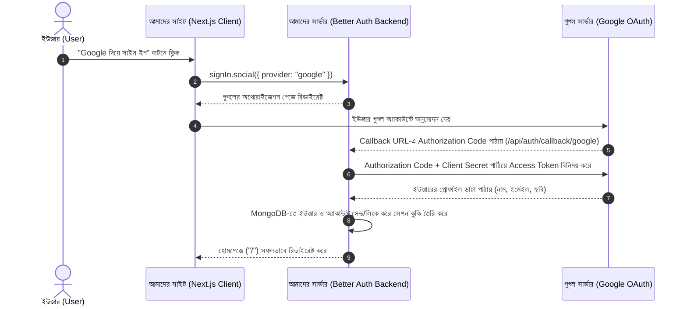

# Module 41-6 & 41-7: Social Login (Google & GitHub OAuth) (স্টাডি ও ইন্টারভিউ নোট)

---

## ১. ক্লাসের মূল উদ্দেশ্য (Key Objectives)
1. **OAuth 2.0 এবং SSO (Single Sign-On):** ইউজারকে পাসওয়ার্ড মনে রাখার ঝামেলা ছাড়া এক ক্লিকে Google বা GitHub অ্যাকাউন্ট দিয়ে সাইন ইন ও সাইন আপ করার সুবিধা দেওয়া।
2. **Better Auth-এ Social Providers সেটআপ:** সার্ভার সাইডে `betterAuth({ socialProviders: { google, github } })` কনফিগার করা।
3. **ক্লায়েন্ট সাইড ইন্টিগ্রেশন:** `signIn.social({ provider, callbackURL })` মেথডের মাধ্যমে রিডাইরেক্ট ফ্লো শুরু করা।
4. **প্রফেশনাল UI কম্পোনেন্ট তৈরি:** Google ও GitHub-এর অফিসিয়াল ব্র্যান্ড কালার ও লোগো সংবলিত পুনঃব্যবহারযোগ্য `SocialLogin.tsx` কম্পোনেন্ট তৈরি করা।

---

## ২. OAuth 2.0 আর্কিটেকচার ও কীভাবে কাজ করে (How OAuth Works Under the Hood)

OAuth 2.0 হলো একটি অথোরাইজেশন ফ্রেমওয়ার্ক। এটি নিচের ধাপে সম্পন্ন হয়:



---

## ৩. কনফিগারেশন ও কোড বিশ্লেষণ

### ক) সার্ভার কনফিগারেশন: `src/lib/auth.ts`
```typescript
export const auth = betterAuth({
  database: mongodbAdapter(db, { client }),
  emailAndPassword: { enabled: true },

  // সোশ্যাল প্রোভাইডার কনফিগারেশন
  socialProviders: {
    google: {
      clientId: process.env.BETTER_AUTH_GOOGLE_CLIENT_ID || "",
      clientSecret: process.env.BETTER_AUTH_GOOGLE_SECRET || "",
    },
    github: {
      clientId: process.env.BETTER_AUTH_GITHUB_CLIENT_ID || "",
      clientSecret: process.env.BETTER_AUTH_GITHUB_SECRET || "",
    },
  },
});
```
- **ইন্টারভিউ নোট:** `clientId` এবং `clientSecret` কখনো হার্ডকোড করা যাবে না। এগুলো অবশ্যই `.env.local` থেকে সিকিউরলি লোড করতে হবে। বিশেষ করে `clientSecret` শুধুমাত্র সার্ভারে থাকে, ক্লায়েন্টে কখনো উন্মুক্ত হয় না।

---

### খ) ক্লায়েন্ট কম্পোনেন্ট: `src/app/components/SocialLogin.tsx`
```tsx
"use client";

import { useState } from "react";
import { signIn } from "@/lib/auth-client";

export default function SocialLogin({ callbackURL = "/" }: { callbackURL?: string }) {
  const [loadingProvider, setLoadingProvider] = useState<"google" | "github" | null>(null);

  const handleSocialSignIn = async (provider: "google" | "github") => {
    try {
      setLoadingProvider(provider);
      // Better Auth এর সোশ্যাল সাইন ইন মেথড
      await signIn.social({
        provider,
        callbackURL, // সফল হলে কোথায় নিয়ে যাবে
      });
    } catch (error) {
      console.error(`${provider} সাইন ইন ব্যর্থ হয়েছে:`, error);
      setLoadingProvider(null);
    }
  };

  return (
    <div className="w-full flex flex-col gap-3">
      {/* ডিভাইডার */}
      <div className="relative my-2 flex items-center justify-center">
        <div className="w-full border-t border-neutral-300" />
        <span className="bg-white px-3 text-xs uppercase text-neutral-500">অথবা</span>
      </div>

      {/* গুগল বাটন */}
      <button onClick={() => handleSocialSignIn("google")} disabled={loadingProvider !== null}>
        {loadingProvider === "google" ? <Spinner /> : <GoogleIcon />}
        <span>Google দিয়ে সাইন ইন করুন</span>
      </button>

      {/* গিটহাব বাটন */}
      <button onClick={() => handleSocialSignIn("github")} disabled={loadingProvider !== null}>
        {loadingProvider === "github" ? <Spinner /> : <GitHubIcon />}
        <span>GitHub দিয়ে সাইন ইন করুন</span>
      </button>
    </div>
  );
}
```

---

## ৪. Google ও GitHub কনসোলে সেটআপের নিয়ম (DevOps & Setup Guide)

### ১. Google Cloud Console:
1. [Google Cloud Console](https://console.cloud.google.com/)-এ গিয়ে একটি নতুন প্রজেক্ট তৈরি করুন।
2. **APIs & Services > OAuth consent screen** কনফিগার করুন (User Type: External)।
3. **Credentials > Create Credentials > OAuth client ID** নির্বাচন করুন:
   - Application type: **Web application**
   - Authorized JavaScript origins: `http://localhost:3000`
   - **Authorized redirect URIs (সবচেয়ে জরুরি):**  
     `http://localhost:3000/api/auth/callback/google`
4. প্রাপ্ত `Client ID` ও `Client Secret` সংগ্রহ করে `.env.local`-এ বসাতে হয়।

### ২. GitHub Developer Settings:
1. GitHub প্রোফাইল থেকে **Settings > Developer settings > OAuth Apps > New OAuth App**-এ যান।
2. ফর্ম পূরণ করুন:
   - Homepage URL: `http://localhost:3000`
   - **Authorization callback URL:**  
     `http://localhost:3000/api/auth/callback/github`
3. প্রাপ্ত `Client ID` ও নতুন `Client Secret` জেনারেট করে `.env.local`-এ বসাতে হয়।

---

## ৫. SCIC ও টেকনিক্যাল ইন্টারভিউ প্রশ্নাবলী (Interview Q&A)

### প্রশ্ন ১: OAuth 2.0 তে `Client Secret` ক্লায়েন্ট সাইডে (Browser-এ) কেন এক্সপোজ করা যাবে না?
> **উত্তর:** `Client Secret` হলো আপনার অ্যাপ্লিকেশনের ব্যক্তিগত পাসওয়ার্ড। যদি এটি ব্রাউজার কোডে উন্মুক্ত থাকে, তবে যে কোনো আক্রমণকারী আপনার অ্যাপ্লিকেশনের পরিচয় ব্যবহার করে ফিশিং অ্যাটাক চালাতে পারবে বা ইউজারের অনুমোদন ছাড়াই ডাটা অ্যাক্সেস করতে পারবে। তাই সমস্ত টোকেন বিনিময় ব্যাকএন্ড সার্ভারে গোপনে করা হয়।

### প্রশ্ন ২: Better Auth-এ Redirect URI বা Callback URL কী এবং এর ফরম্যাট কী?
> **উত্তর:** ইউজার গুগল বা গিটহাবে লগইন অ্যাপ্রুভ করার পর প্রোভাইডার যে লিংকে সিকিউরিটি কোডসহ রিডাইরেক্ট করে তাকে Callback URL বলে। Better Auth-এ এর ডিফল্ট ফরম্যাট হলো:  
> `[SITE_URL]/api/auth/callback/[provider]`  
> যেমন: `http://localhost:3000/api/auth/callback/google`।

### প্রশ্ন ৩: যদি একজন ইউজার আগে ইমেইল ও পাসওয়ার্ড দিয়ে সাইনআপ করে এবং পরে একই ইমেইল দিয়ে Google দিয়ে লগইন করে, তবে কী ঘটে (Account Linking)?
> **উত্তর:** Better Auth বুদ্ধিমত্তার সাথে একই ইমেইলের অ্যাকাউন্টের সাথে গুগল বা গিটহাব অ্যাকাউন্টকে "Account Linking"-এর মাধ্যমে যুক্ত করে নেয়। ফলে ইউজারের একাধিক ডুপ্লিকেট অ্যাকাউন্ট তৈরি হয় না।

---

## ৬. সংক্ষেপ চেকলিস্ট

| কাজ | কোড / পাথ |
| :--- | :--- |
| **সার্ভার কনফিগ** | `src/lib/auth.ts` -> `socialProviders: { google, github }` |
| **লগইন মেথড** | `await signIn.social({ provider: "google" \| "github", callbackURL: "/" })` |
| **গুগল রিডাইরেক্ট ইউআরএল** | `http://localhost:3000/api/auth/callback/google` |
| **গিটহাব রিডাইরেক্ট ইউআরএল** | `http://localhost:3000/api/auth/callback/github` |
